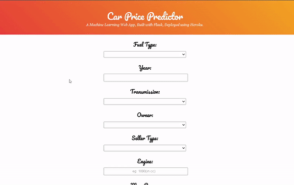

# Car Price Prediction
   


## Table of Contents

 - [Demo](#demo)
 - [Overview](#overview)
 - [Motivation](#motivation)
 - [Installation](#installation)
 - [Deployement on Heroku](#deployement-on-heroku)
 - [Directory Tree](#directory-tree)
 - [Bug / Feature Request](#bug--feature-request)
 - [Future scope of project](#future-scope)
 - [Credits](#credits)

## Demo
Link:



## Overview

This is a Flask web app which predicts price of cars.You need to fill out the details of your car and can see for how much price you can sell your car.
## Motivation

I started to learn Data Sience during second year of my college as this subject intrigued me quite a lot. So i started with Machine Learning first and came to know mathematics behind all supervised as well as unsupervised models. Finally it is important to work on application (real world application) to actually make a difference.
## Installation

The Code is written in Python 3.9.16. If you don't have Python installed you can find it [here](https://www.python.org/downloads/). If you are using a lower version of Python you can upgrade using the pip package, ensuring you have the latest version of pip. To install the required packages and libraries, run this command in the project directory after [cloning](https://www.howtogeek.com/451360/how-to-clone-a-github-repository/) the repository:

```bash
pip install -r requirements.txt
```
## Deployement on Heroku


## Directory Tree

```
├── resource 
│   ├── carpredict.gif
├── static 
│   ├── css
│         ├── style.css
├── template
│   ├── index.html
│   ├── result.html
├── Prediction.ipynb
├── Procfile
├── README.md
├── app.py
├── car details v4.csv
├── requirements.txt
├── test.pkl
```

## Bug / Feature Request

If you find a bug (the website couldn't handle the query and / or gave undesired results), kindly open an [issue](https://github.com/Sajid030/car_price_prediction/issues) here by including your search query and the expected result

## Future Scope

- Use multiple Algorithms
- Optimize Flask app.py
- Front-End 

## Credits
- Dataset link : https://www.kaggle.com/datasets/nehalbirla/vehicle-dataset-from-cardekho?select=car+details+v4.csv
